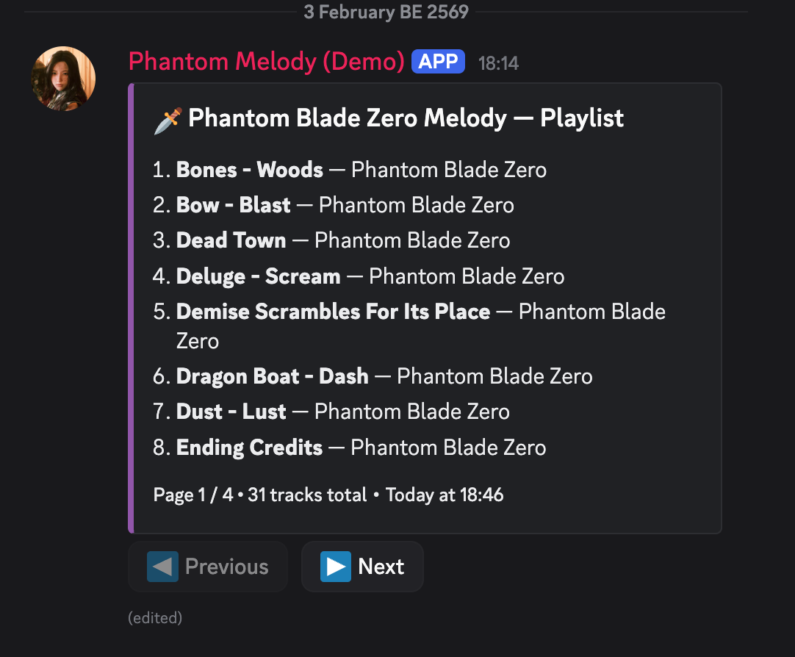
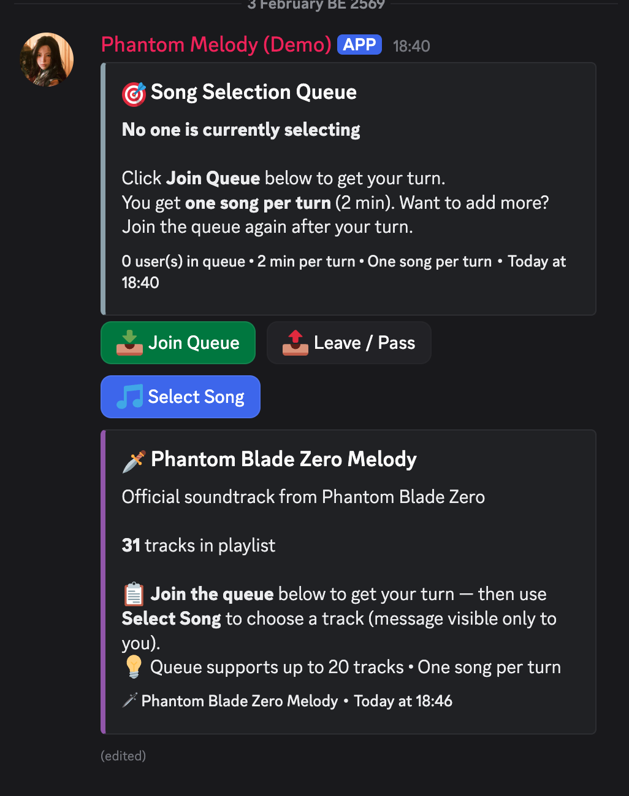
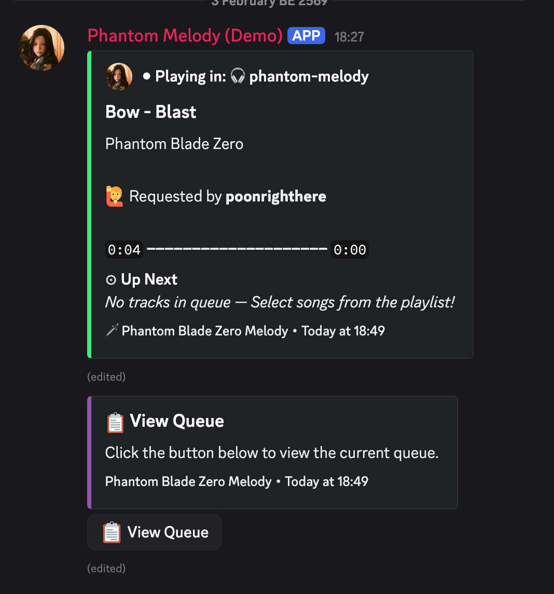
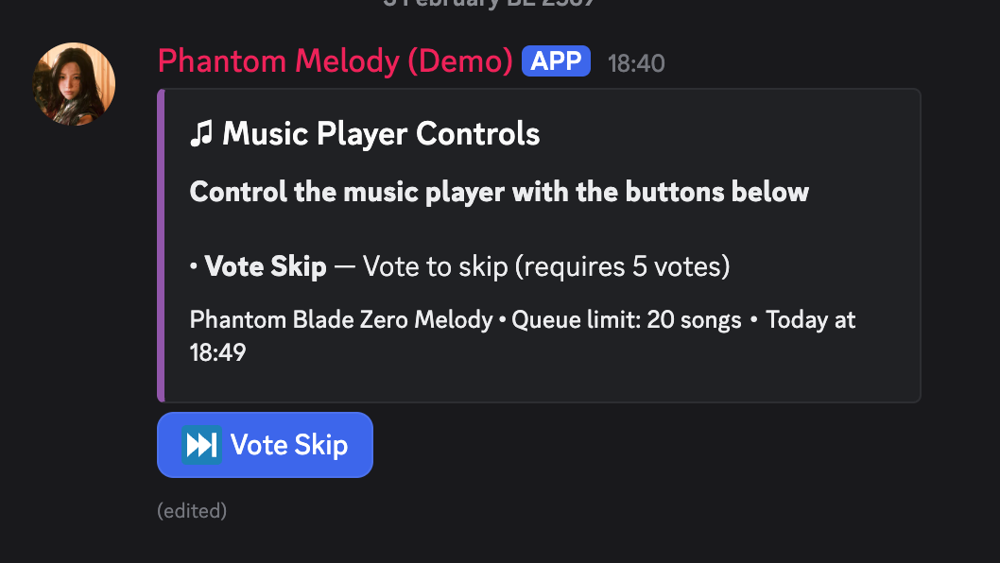
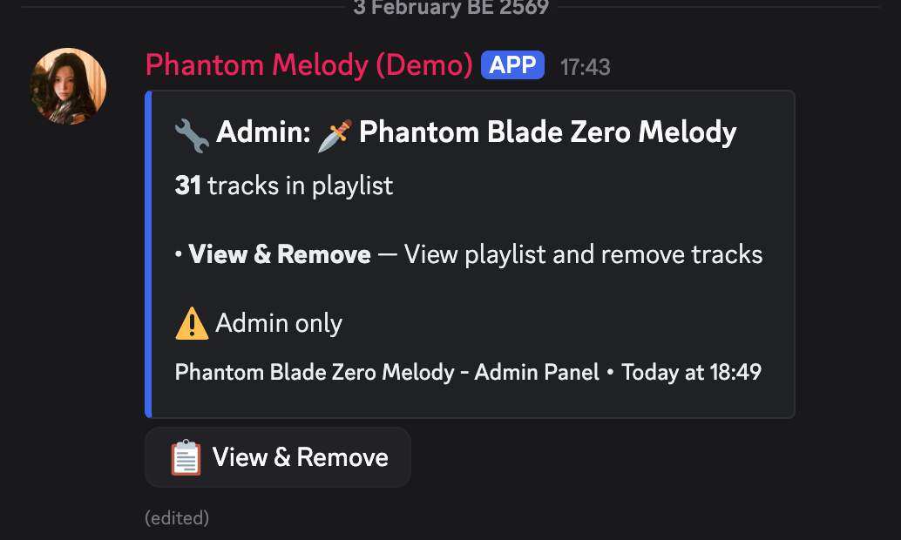
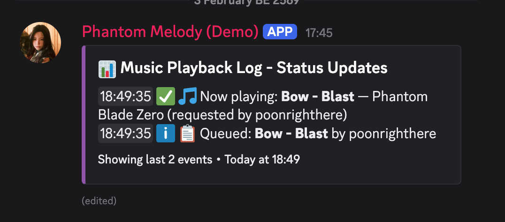
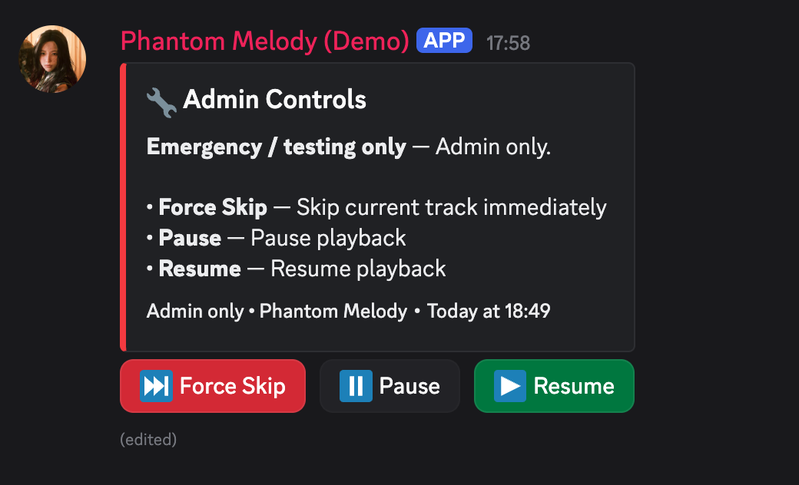

# Phantom Radio Bot

A Discord music bot for Phantom Blade Zero community. Features a turn-based song selection queue system for fair music sharing.

In multi-stack deployment (e.g. `start-all.sh` in dev), this is **Stack 5**; uses shared MongoDB and Honor Points API from **honor-points-service (Stack 1)** when configured.

## Screenshots

### Playlist Channel


_Show available songs_

### Selection Queue


_Turn-based queue system for fair song selection_

### Now Playing Display


_Beautiful display with progress bar and upcoming queue_

### Vote Skip


_Vote skip song (requires 10 votes)_

### Admin Playlist Manager


_Add and remove songs from playlist_

### Admin Logs


_Activity logs for playlist changes and playback events_

### Admin Controls


_Force Skip, Play and pause song by admin_

## Recent changes (summary)

- **Multi-album playlist** — Music is organized in **7 album folders** under `music/` (e.g. `2014_Phantom-Blade-1`, `2025_Phantom-Blade-Zero-Soundtrack`). Supported formats: `.wav`, `.mp3`, `.ogg`. Sync with `docker-compose exec phantom-radio npm run sync-pbz` (see [BGM / Playlist sync](#bgm--playlist-sync-when-running-with-docker)).
- **Song selection flow** — When it's your turn: **choose an album** first, then pick a song from that album (ephemeral). A **Back to albums** button lets you return to album selection without dismissing.
- **Song Selection channel** — No public multi-page playlist embed; the track list is shown only in the ephemeral flow (album → song). Optional: set `PHANTOM_RADIO_PLAYLIST_CHANNEL_ID` for a separate playlist display channel.
- **Vote Skip** — Now requires **10 votes** (was 5).
- **Channel layout** — Music Player: one message (Now Playing + Vote Skip + View Queue). Song Selection: Join Queue, Select Song, Leave; album/song choice is ephemeral.
- **Queue rules** — Max **20 songs** total; **5 songs per user** (slot freed when your song finishes).
- **Display** — All user-facing text is in English (global bot).

## Features

### 🎵 Multi-Album Playlist

Music is stored in **7 album folders** under `music/` (see `music/README.md`). Users choose an album, then a song from that album, and add it to the shared queue. Supports `.wav`, `.mp3`, and `.ogg`.

### 🎯 Selection Queue System

A fair turn-based system for selecting songs:

- Users join a selection queue to wait for their turn
- Each user has **2 minutes** to select a song
- After selecting, the next person in queue gets their turn
- If time expires, the turn passes to the next person
- Prevents multiple users from competing to add songs simultaneously

### 🎧 Music Playback

- **Now Playing Display** - Beautiful real-time display showing current track, progress bar, and upcoming queue
- **Vote Skip** - Requires 10 votes to skip a song
- **View Queue** - See the current music queue (up to 20 songs)
- Single voice channel enforcement for shared listening experience

### 👑 Admin Features

- Add songs via YouTube URL
- Remove songs from playlist
- Activity logs for all playlist changes, queue additions, and playback events

## Channels

Each channel has a specific role. Set the Channel IDs in `.env` to match the channels you create in Discord.

### User channels

| Channel (example name)               | Env variable                              | Purpose                                                                                                                                                                                     |
| ------------------------------------ | ----------------------------------------- | ------------------------------------------------------------------------------------------------------------------------------------------------------------------------------------------- |
| `#phantom-radio-music-player`        | `PHANTOM_RADIO_MUSIC_PLAYER_CHANNEL_ID`   | **Vote Skip + View Queue + Now Playing** — Vote Skip button, Now Playing (progress, queue), View Queue (combined in one channel)                                                            |
| `#phantom-radio-song-selection`      | `PHANTOM_RADIO_SONG_SELECTION_CHANNEL_ID` | **Join queue & select song** — Join Queue → Select Song → choose album, then song (ephemeral; up to 5 songs/user). Optional playlist display if `PHANTOM_RADIO_PLAYLIST_CHANNEL_ID` is set. |
| `#phantom-radio-manual`              | `PHANTOM_RADIO_MANUAL_CHANNEL_ID`         | **User guide** — Bot posts an embed with instructions and clickable channel links (<#id>)                                                                                                   |
| Voice channel (e.g. `phantom-radio`) | `PHANTOM_RADIO_VOICE_CHANNEL_ID`          | **Voice** — Music plays here; listeners must be in this channel                                                                                                                             |

### Admin channels

| Channel (example name)          | Env variable                | Purpose                                                             |
| ------------------------------- | --------------------------- | ------------------------------------------------------------------- |
| `#admin-phantom-radio-logs`     | `ADMIN_LOGS_CHANNEL_ID`     | **Logs** — Queue additions, playback, skip, track removal, etc.     |
| `#admin-phantom-radio-playlist` | `ADMIN_PLAYLIST_CHANNEL_ID` | **Manage playlist** — View & Remove buttons to view/remove tracks   |
| `#admin-phantom-radio-control`  | `ADMIN_CONTROL_CHANNEL_ID`  | **Emergency/test control** — Force Skip, Pause, Resume (admin only) |

### Optional channels

| Channel               | Notes                                                                       |
| --------------------- | --------------------------------------------------------------------------- |
| `#phantom-radio-chat` | General chat; no env variable — use for discussion or bot-related questions |

## User Interface

### Music Player channel (`#phantom-radio-music-player`) — single message

- **One message only**: the Now Playing embed (or idle “No music currently playing”) with **Vote Skip** and **View Queue** buttons directly below it.
- **Vote Skip** — Skip when 10 votes are reached.
- **View Queue** — Opens full queue (ephemeral).
- Queue limits: **20 songs max** total, **5 songs per user** (when one of your songs finishes, you get a slot back).

### Song Selection channel (`#phantom-radio-song-selection`)

1. **Info embed** — Track count + instructions: Join queue → Select Song → **choose an album**, then pick a song (ephemeral).
2. **Song Selection Queue** — Current selector, time remaining, Join Queue / Leave / Select Song buttons.
3. When it's your turn, an ephemeral message shows **album dropdown** → after choosing an album, **song dropdowns** for that album, plus a **Back to albums** button to choose a different album (up to 5 songs per user in queue).

## YouTube Playback

The bot uses **yt-dlp** for reliable YouTube audio streaming:

| Component      | Technology                        |
| -------------- | --------------------------------- |
| Metadata       | yt-dlp `--dump-json`              |
| Audio Stream   | yt-dlp + Android client → Discord |
| Voice Playback | @discordjs/voice + FFmpeg         |

This approach avoids common issues with JavaScript YouTube libraries that break frequently.

## Setup

### Prerequisites

- Node.js 18+
- MongoDB (local or Atlas)
- Discord Bot Token
- FFmpeg (for audio processing)
- **yt-dlp** (Docker image includes this)

### Inviting the bot

1. Open [Discord Developer Portal](https://discord.com/developers/applications) → your application (or create one) → **OAuth2** → **URL Generator**.
2. **Scopes** (tick these):
   - `bot` — Bot user and its permissions.
   - `applications.commands` — Register slash commands in the server.
3. **Bot permissions** (tick these, or use “Administrator” for testing only):
   - **View Channels** — See channels.
   - **Send Messages** — Send embeds and messages.
   - **Embed Links** — Rich embeds (Now Playing, queue, etc.).
   - **Read Message History** — Read channel history (for finding/editing its own messages).
   - **Manage Messages** — Edit/delete its own messages (e.g. updating Now Playing).
   - **Connect** — Join the voice channel.
   - **Speak** — Play audio in the voice channel.
4. Copy the generated URL, open it in a browser, choose your server, and complete the invite.

### Bot & channel permissions

| Who        | Where                       | Permissions needed                                                                                                                                                                                                                     |
| ---------- | --------------------------- | -------------------------------------------------------------------------------------------------------------------------------------------------------------------------------------------------------------------------------------- |
| **Bot**    | All bot channels            | View Channel, Send Messages, Embed Links, Read Message History, Manage Messages (so it can edit the single Now Playing message).                                                                                                       |
| **Bot**    | Voice channel               | View Channel, Connect, Speak.                                                                                                                                                                                                          |
| **Bot**    | Server (for slash commands) | Use Application Commands (granted by invite with `applications.commands`).                                                                                                                                                             |
| **Users**  | Music Player channel        | View Channel, Read Message History (to see the message and use Vote Skip / View Queue buttons).                                                                                                                                        |
| **Users**  | Song Selection channel      | View Channel, Read Message History (to use Join Queue, Select Song, playlist pages).                                                                                                                                                   |
| **Users**  | Voice channel               | View Channel, Connect (to listen).                                                                                                                                                                                                     |
| **Admins** | Admin channels              | View Channel, Read Message History; bot needs Send Messages + Embed Links there. Admin-only actions (Force Skip, Pause, Remove tracks) require the user to have **Administrator** (or you can change the code to use a specific role). |

Ensure the bot role is **above** the voice channel’s permission overwrites if you restrict access (so the bot can always Connect + Speak).

### Installation

1. Clone the repository

```bash
git clone <repository-url>
cd phantom-radio
```

2. Install dependencies

```bash
npm install
```

3. Create a `.env` file

```bash
cp .env.example .env
```

4. Configure environment variables (see below)

5. Deploy slash commands

```bash
npm run deploy
```

6. Start the bot

```bash
# Development
npm run dev

# Production
npm run build
npm start
```

### Docker Setup

#### Share MongoDB with Honor Bot (Recommended)

1. Make sure Honor Bot is running:

   ```bash
   cd ../honorbot-pbz
   docker-compose up -d
   ```

2. Build and run Phantom Radio:

   ```bash
   cd phantom-radio
   docker-compose up -d --build
   ```

3. View logs:
   ```bash
   docker-compose logs -f phantom-radio
   ```

#### BGM / Playlist sync when running with Docker

- Place audio files (`.wav`, `.mp3`, `.ogg`) in `./music/{albumSlug}/` on the host (see `music/README.md` for the 7 album folders). The `./music` folder is mounted into the container.
- **Run the sync inside the container** (Node 20, same network as MongoDB):

  ```bash
  # From project root — runs sync in a one-off container (uses MONGO_URI from docker-compose)
  # If you see "Read timed out", use a longer timeout:
  COMPOSE_HTTP_TIMEOUT=300 docker-compose run --rm phantom-radio npm run sync-pbz
  ```

  Or, if the bot container is already running:

  ```bash
  docker-compose exec phantom-radio npm run sync-pbz
  ```

- If you run MongoDB on the host and want to sync from the host instead, use Node 18+ and: `MONGO_URI=mongodb://localhost:27017/honorbot npm run sync-pbz` (or `npm run sync-pbz:host`).

Optional env for shared dev setup: `HONOR_POINTS_API_URL`, `HONOR_POINTS_API_KEY` (central Honor Points API); `BOTS_LOGGER_URL`, `BOTS_LOGGER_API_KEY` (action logging).

#### Docker Commands

```bash
# Start bot
docker-compose up -d

# Stop bot
docker-compose down

# View logs
docker-compose logs -f phantom-radio

# Rebuild after code changes
docker-compose up -d --build

# Restart bot
docker-compose restart phantom-radio
```

## Rebuild after code changes

If you change display text (e.g. placeholders, messages) or add new buttons, **rebuild and restart** so the bot uses the new code:

- **Docker:** `docker-compose up -d --build`
- **Local:** `npm run build` then restart the process (`npm start` or `node dist/index.js`)

## Environment Variables

| Variable                                  | Description                                                                                                          |
| ----------------------------------------- | -------------------------------------------------------------------------------------------------------------------- |
| `DISCORD_TOKEN`                           | Phantom Radio bot token                                                                                              |
| `CLIENT_ID`                               | Discord application client ID                                                                                        |
| `GUILD_ID`                                | Server (guild) ID for command deployment                                                                             |
| `MONGO_URI`                               | MongoDB connection string                                                                                            |
| **User Channels**                         |                                                                                                                      |
| `PHANTOM_RADIO_VOICE_CHANNEL_ID`          | Voice channel for music playback                                                                                     |
| `PHANTOM_RADIO_MUSIC_PLAYER_CHANNEL_ID`   | Vote Skip + Now Playing + View Queue (combined in one channel)                                                       |
| `PHANTOM_RADIO_SONG_SELECTION_CHANNEL_ID` | Join queue + Select Song (album → song, 5/user). Optional: `PHANTOM_RADIO_PLAYLIST_CHANNEL_ID` for playlist display. |
| `PHANTOM_RADIO_MANUAL_CHANNEL_ID`         | Guide message with clickable channel links (<#id>)                                                                   |
| `PHANTOM_RADIO_PLAYLIST_CHANNEL_ID`       | Optional: separate channel for multi-page playlist embed                                                             |
| **Admin Channels**                        |                                                                                                                      |
| `ADMIN_LOGS_CHANNEL_ID`                   | Admin logs - playlist changes, queue, playback events                                                                |
| `ADMIN_PLAYLIST_CHANNEL_ID`               | Admin panel for Add/Remove songs                                                                                     |
| `ADMIN_CONTROL_CHANNEL_ID`                | Admin-only: Force Skip / Pause / Resume (emergency or testing)                                                       |
| **Legacy**                                |                                                                                                                      |
| `PHANTOM_RADIO_TEXT_CHANNEL_ID`           | Fallback text channel                                                                                                |

## Admin: Adding Songs

Admins can add songs through the Admin Playlist channel:

1. Click **Add Song** button
2. Enter YouTube URL in the modal
3. Optionally customize title and artist
4. Song is automatically added to the playlist

Songs can also be added via the `/addtrack` slash command (admin only).

## Logs

The Admin Logs channel displays:

| Event          | Example                                    |
| -------------- | ------------------------------------------ |
| Track added    | `✅ Admin added track: **Track Name**`     |
| Track removed  | `ℹ️ Admin removed track: **Track Name**`   |
| Song queued    | `ℹ️ 📋 Queued: **Track Name** by Username` |
| Now playing    | `✅ 🎵 Now playing: **Track Name**`        |
| Track finished | `ℹ️ 🏁 Finished: **Track Name**`           |
| Vote skip      | `ℹ️ ⏭️ Skipped: Track Name (vote skip)`    |

## Database

Shares MongoDB with Honor Bot for user data consistency.

### Collections

- `tracks` - Music tracks with metadata
- `playlists` - Playlist configuration
- `users` - Shared with Honor Bot
- `listeninghistories` - User listening history

## Automatic Features

- **Daily Shuffle**: Playlists shuffled at midnight UTC
- **Listening Tracking**: Voice channel time tracked for rewards

## License

ISC
